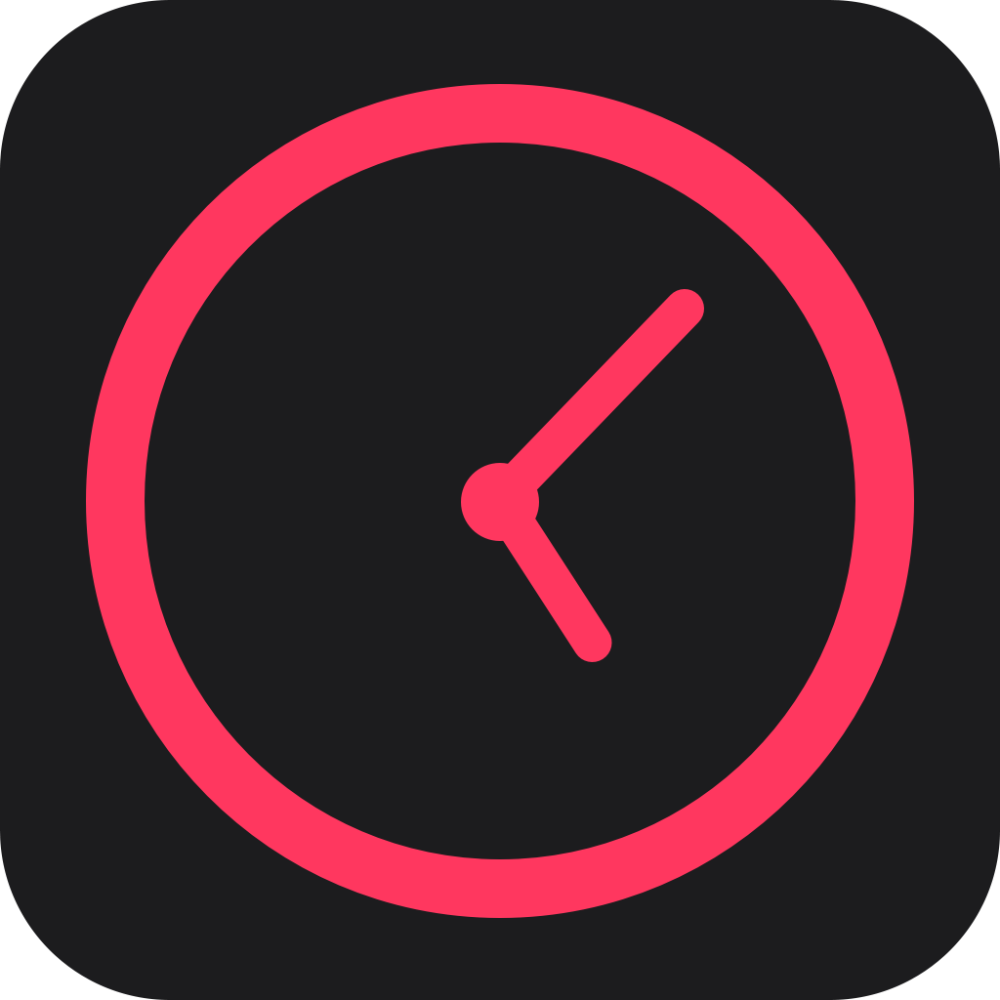

   <h3>Hi there, I'm <a href="https://coreysmith.me">Corey</a>  </h3>

<!-- Typing SVG by DenverCoder1 - https://github.com/DenverCoder1/readme-typing-svg -->

  

## ⭐  About Me
- 🙋 I'm a **Computer Engineer**
- 📚 I graduated from the **University of North Texas**
- 🔭 I’m currently working on **all things SwiftUI**
- 🌱 I’m currently learning **React**
- 💬 Ask me about **my apps on the apple App Store**
- ⚡ Fun fact: **I am a Rated United States Parachute Association Coach**

## 📫 How To Reach Me

&nbsp;

&nbsp;

&nbsp;

##  My Apps

&nbsp;

&nbsp;

## ⚡ Technologies I Use

[][learning_now_anchor]
&nbsp;
[][tech_tools_anchor]
&nbsp;
[][learning_now_anchor]
&nbsp;
[][learning_now_anchor]
&nbsp;
[][tech_tools_anchor]
&nbsp;
[][tech_tools_anchor]
&nbsp;
[][tech_tools_anchor]
&nbsp;
[][learning_next_anchor]
&nbsp;
[][tech_tools_anchor]
&nbsp;
[][learning_next_anchor]
&nbsp;

[tech_tools_anchor]: #bonjour--
[learning_now_anchor]: #learning-now
[learning_next_anchor]: #learning-next
